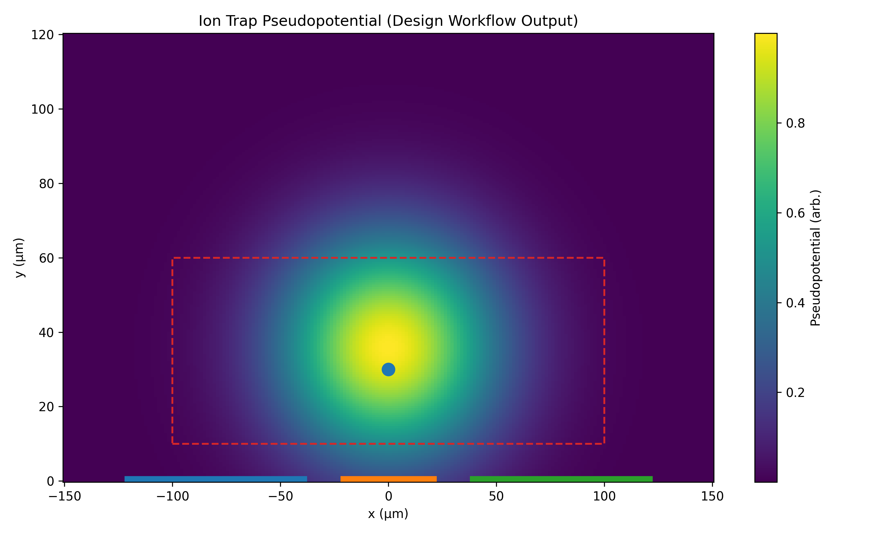

# Ion Trap Parameter Lab

**Electrostatic Design and Optimization Workflow for Surface-Electrode Ion Traps**



---

## Overview

This project implements a **numerical workflow for surface-electrode ion trap design**, combining electrostatic modeling, optimization, and physical interpretation.

It demonstrates an end-to-end pipeline:

> **geometry → Laplace solve → E-field → pseudopotential → trap detection → optimization → physical metrics**

The system produces physically meaningful outputs:

* Trap height (**µm**)
* Pseudopotential scale (**eV**)
* Secular frequencies (**MHz**)

---

## How this maps to real ion-trap R&D

This repository mirrors the core trapped-ion design workflow:

geometry → electrostatics → fields → pseudopotential → trap → optimization → physical metrics

For a detailed explanation of how each step corresponds to real experimental and computational methods:

👉 [docs/ion_trap_context.md](docs/ion_trap_context.md)

---

## Key Idea

We optimize trap designs using a physically motivated objective:

```
score = trap_strength / trap_height²
```

Where:

* **trap_strength** = sum of positive curvature eigenvalues (Hessian)
* **trap_height** = distance above electrode plane

This balances:

* strong confinement (↑ curvature)
* practical trapping height (↓ height)

---

## Quickstart (Colab)

Run the full pipeline directly:

👉 [Open Notebook 09 (Full Pipeline)](https://colab.research.google.com/github/thinkthoughts/ion-trap-parameter-lab/blob/main/notebooks/09_integrated_optimization_to_physical_design_summary_v2.ipynb)

---

### Step-by-step notebooks

| Notebook | Description                             | Colab                                                                                                                                                                    |
| -------- | --------------------------------------- | ------------------------------------------------------------------------------------------------------------------------------------------------------------------------ |
| 01       | Laplace solver (2D surface electrodes)  | [Open](https://colab.research.google.com/github/thinkthoughts/ion-trap-parameter-lab/blob/main/notebooks/01_laplace_solver_2d_surface_trap.ipynb)                        |
| 02       | Electric field + streamlines            | [Open](https://colab.research.google.com/github/thinkthoughts/ion-trap-parameter-lab/blob/main/notebooks/02_electric_field_and_streamlines.ipynb)                        |
| 03       | RF pseudopotential + trap height        | [Open](https://colab.research.google.com/github/thinkthoughts/ion-trap-parameter-lab/blob/main/notebooks/03_rf_pseudopotential_and_trap_height.ipynb)                    |
| 04       | Curvature + secular frequency proxy     | [Open](https://colab.research.google.com/github/thinkthoughts/ion-trap-parameter-lab/blob/main/notebooks/04_trap_curvature_and_secular_frequency_proxy_v2.ipynb)         |
| 05       | Voltage sweeps                          | [Open](https://colab.research.google.com/github/thinkthoughts/ion-trap-parameter-lab/blob/main/notebooks/05_voltage_sweeps_and_trap_optimization_maps.ipynb)             |
| 06       | Geometry sweeps                         | [Open](https://colab.research.google.com/github/thinkthoughts/ion-trap-parameter-lab/blob/main/notebooks/06_geometry_sweeps_width_and_gap_v3.ipynb)                      |
| 07       | Combined optimization                   | [Open](https://colab.research.google.com/github/thinkthoughts/ion-trap-parameter-lab/blob/main/notebooks/07_combined_voltage_geometry_optimization.ipynb)                |
| 08       | Physical scaling + best trap selection  | [Open](https://colab.research.google.com/github/thinkthoughts/ion-trap-parameter-lab/blob/main/notebooks/08_physical_scaling_and_best_trap_selection_v3.ipynb)           |
| 09       | Full pipeline → physical design summary | [Open](https://colab.research.google.com/github/thinkthoughts/ion-trap-parameter-lab/blob/main/notebooks/09_integrated_optimization_to_physical_design_summary_v2.ipynb) |

---

## Example Output

From the full pipeline:

* Trap height ≈ **30 µm**
* Secular frequency ≈ **1–2 MHz**
* Stable RF pseudopotential minimum
* Optimized electrode geometry + voltages

These values are consistent with typical surface-electrode ion traps.

---

## Workflow Details

### 1. Electrostatics

* Solve Laplace equation with electrode boundary conditions
* Surface-electrode geometry (RF + DC rails)

### 2. Field Extraction

* Compute electric field from potential gradient
* Convert to RF pseudopotential

### 3. Trap Detection

* Identify local minima
* Require **positive curvature (Hessian eigenvalues)**

### 4. Optimization

* Sweep:

  * electrode geometry
  * RF voltage
  * DC voltage
* Evaluate using curvature-based objective

### 5. Physical Scaling

* Convert to SI units
* Extract:

  * trap height (µm)
  * pseudopotential (eV)
  * secular frequencies (MHz)

---

## PDF Summary

A concise 1–2 page summary of this workflow (recommended for sharing / applications):

👉 **[Download PDF Summary](docs/ion_trap_parameter_lab_summary.pdf)**

*(Add your PDF to `/docs/`)*

---

## Repository Structure

```
notebooks/
  01_... → 09_...   (full pipeline progression)

figures/
  hero_figure_v2.png

docs/
  ion_trap_parameter_lab_summary.pdf

README.md
requirements.txt
```

---

## Relevance to Trapped-Ion Design

This workflow mirrors early-stage ion trap design:

* electrostatic modeling of electrode layouts
* parameter sweeps for optimization
* curvature-based trap validation
* extraction of physically meaningful performance metrics

It provides a minimal but complete **design → physics → evaluation pipeline**.

---

## Notes

* Model is simplified (2D, no axial confinement)
* RF pseudopotential uses reduced boundary conditions
* Results depend on chosen physical scaling

---

## Next Steps

* refine optimization near best region
* extend to 3D geometries
* add multi-ion / species comparison
* integrate compiled solvers or HPC scaling

---

## Author

Dan Hawkley
Boulder, CO
danhawkley@gmail.com

---

## License

MIT (or your preferred license)
